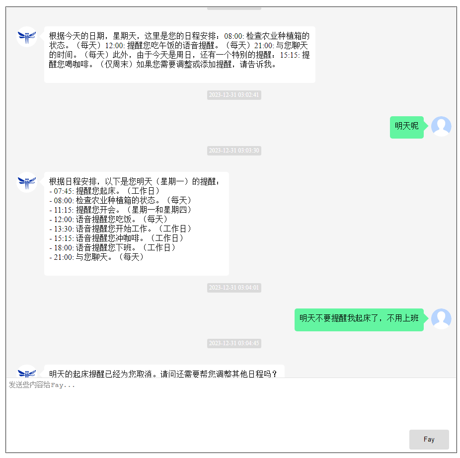
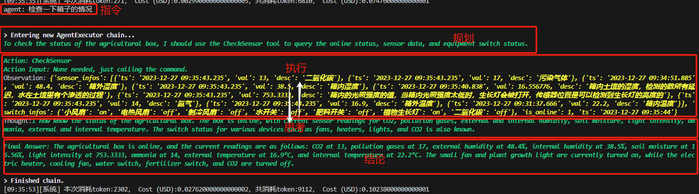
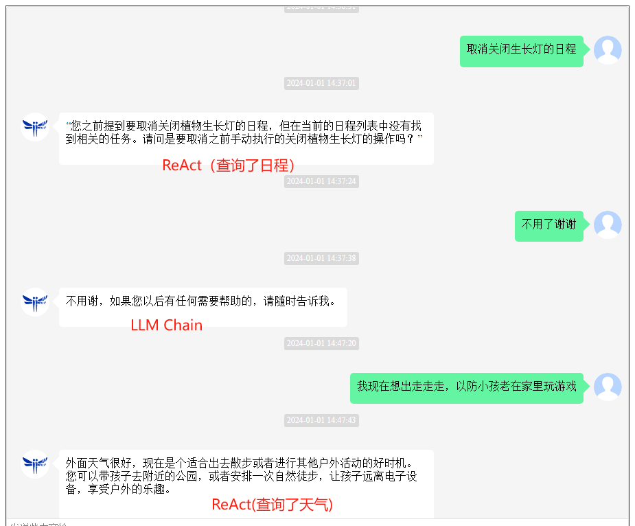
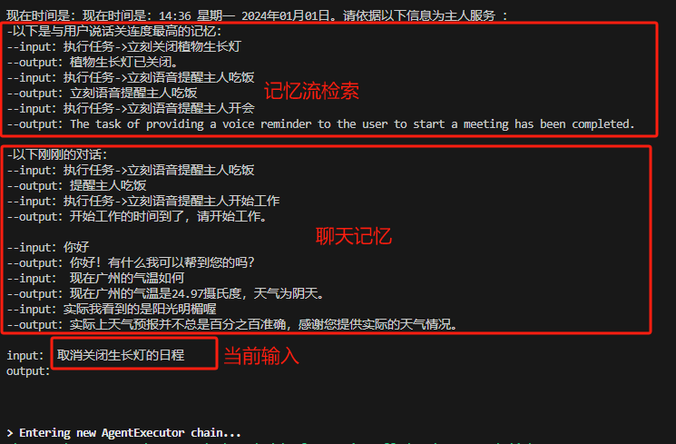
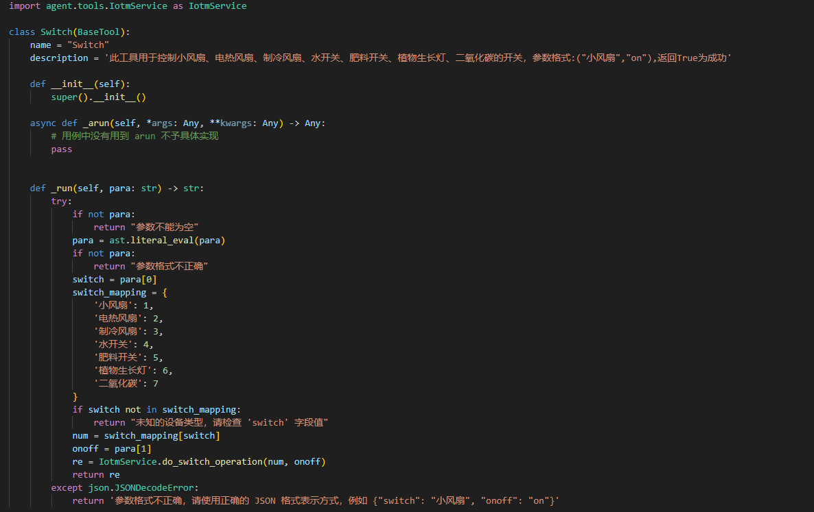

[`English`](README_EN.md)

<div align="center">
    <br>
    
    <h1>Fay数字人 AI Agent版</h1>
    “agent”即代理，它能够代替你完成决策规划并执行，这一切都依赖目前最强的大语言模型的ReAct能力。不同于助理版的一问一答，agent版的Fay可以实现自动代理执行的同时，在它认为必要时候会触发数字人或者直接的声音输出。
</div>


**请先想明白**

如果你需要是一个线上线下的销售员，请移步[`带货完整版`](https://github.com/xszyou/Fay/tree/fay-sales-edition)                       

如果你需要的是一个人机交互的数字人助理（当然，你也可以命令它开关设备），请移步 [`助理完整版`](https://github.com/xszyou/Fay/tree/fay-assistant-edition)


***然后，“优秀的产品都值得用数字人从新做一遍”***
1、基于日程维护的助理模式：执行及维护你的日程，绝不是一个简单的闹钟


2、强大的规划执行（ReAct）能力：规划->执行<->反思->总结


3、LLM Chain与React Agent自动切换：保留规划执行能力的同时兼顾聊天能力（还需优化）


4、双记忆机制：斯坦福AI小镇的记忆流（时间、重要性、相关度）实现长时记忆，邻近对话记忆实现连贯对话


5、易于扩展的agent 工具


6、配套24小时后台运行的android 连接器


## **安装说明**


### **环境要求** 

- Python 3.9、3.10
- Windows、macos、linux

### **安装依赖**

```shell
pip install -r requirements.txt
```

### **配置应用**

+ 将GPT-4 key填入 `./system.conf` 中

### **启动控制器**

启动Fay控制器

```shell
python main.py
```

### **启动数字人（非必须）**

+ 仓库地址：https://github.com/xszyou/fay-ue5

### **启动android 连接器（非必须）**

+ 仓库地址：https://github.com/xszyou/fay-android

### **更新日志**

2024.06.26:

1、新增支持azure tts；

2、tts配置分离；

3、去除农业相关工具；

4、agent逻辑调整；

5、新增可接入moonshot；

6、分离知识库工具，使用需自行在工具内配置。


2024.06.05:

1、新增 面板发送消息工具；

2、funasr增加热词识别。

2024.05.22:

1、去除语音输出工具，改为语音输出只受“语音合成”按钮影响。

2024.05.08:

1、配置项新增gpt模型配置、gpt代理默认空。

2024.04.22:

1、优化获取网页内容工具的兼容性问题；

2、新增gpt代理配置；

3、优化白屏问题。

2024.04.15:

1、前端禁止开启后修改；

2、提高funasr的稳定性。

2024.04.08:

优化gpt兼容接口（为ue新工程架构准备）。

2024.04.01:

增加agent工具：连接本地知识库（pdf）查询、获取网页内容；

2024.03.25:

增加agent工具：python执行器、网页检索器；

2024.03.18:

清除情绪计算的内容

2024.03.04:

优化prompt；

去除llm chain逻辑，减少agent与llm chain切换的token浪费；

优化“思考中...”log，方便后续数字人设计更友好的交互逻辑。

集成funASR最新版本

2024.02.19:

增加gpt接口节点配置 (方便接入镜像站)

2024.02.05:

解决聊天记录存储线程同步问题

*新增tts合成开关

增强funasr稳定性

增加开启服务提醒

fay.db记录上区分agent还是llm回应

*更换最新model gpt-4-0125-preview  

*优化聊天prompt

修复agent meney里的权重fn bug

删除时间查询tool

执行任务触发无需在聊天窗口显示及db中保存

修复删除日程bug

2024.01.29:

增强funasr稳定性

2024.01.22:

增强开启控制器时稳定性


2024.01.15:

新增前置词唤醒方式；

新增gpt兼容接口。

2024.01.08:

远程音频连接状态显示✓

执行任务时记录时间✓

去除计算tool，防止用于时间计算而出错✓

2024.01.01:

openai token计算✓

优化ReAct Agent 与 LLM Chain自动切换逻辑✓

*添加双记忆机制：长时记忆流及短时聊天记忆✓

修复record.py asr bug✓

提高远程音频（android 连接器）的稳定性✓

修复执行时间计算bug✓

优化语音输出逻辑✓

2023.12.25:

*实现agent ReAct与LLM chain自动切换逻辑✓

聊天窗区分任务消息✓

修复删除日程bug✓

优化远程音频逻辑✓

等待处理引入加载中效果✓

优化prompt以解决日程任务递归调用问题✓

修复一次性日程清除的bug✓


### **技术交流**

公众号：fay数字人