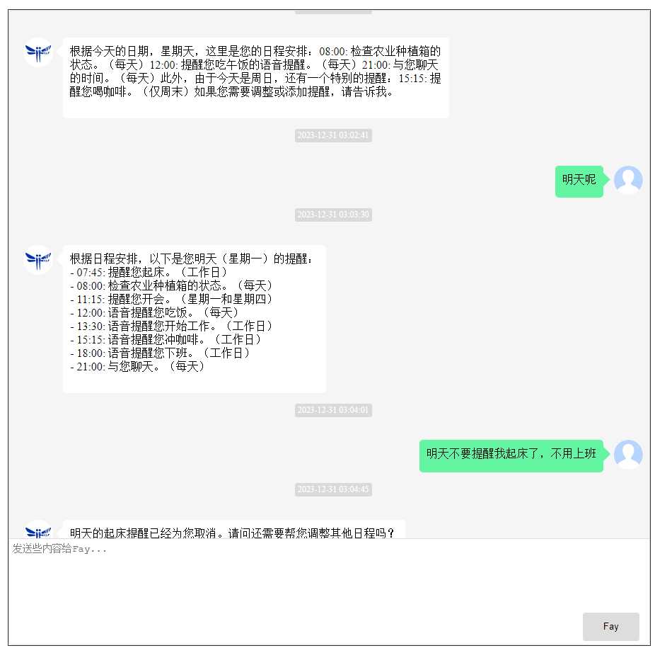
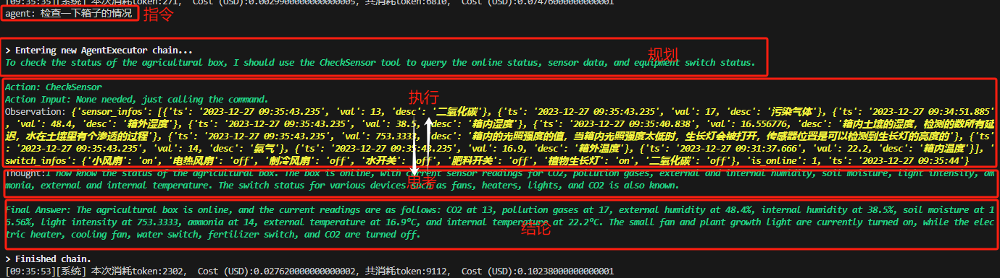
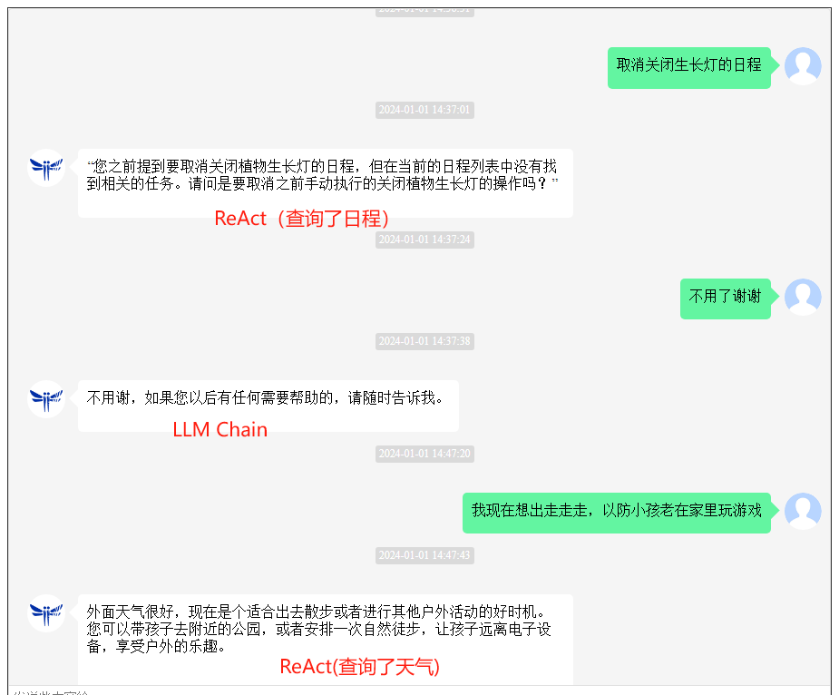
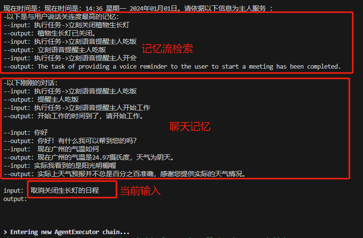
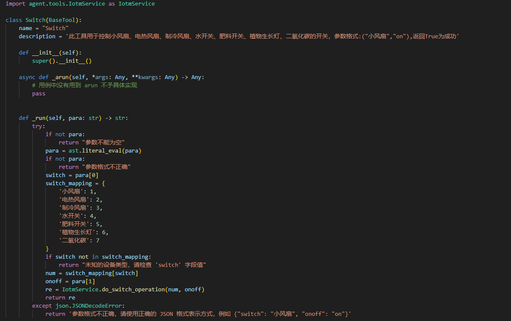

[`中文`](https://github.com/TheRamU/Fay/blob/main/README.md)

<div align="center">
    <br>
    
    <h1>Fay Digital Human AI Agent Version</h1>
    An "agent" is a representative that can make decisions and execute plans for you, relying on the powerful ReAct capability of the most advanced large language models.
</div>


**Please Understand First**

If you need an online and offline salesperson, please go to [`Complete Retail Version`](https://github.com/TheRamU/Fay/tree/fay-sales-edition)

If you need a digital human assistant for human-computer interaction (and yes, you can command it to switch devices on and off), please go to [`Complete Assistant Version`](https://github.com/TheRamU/Fay/tree/fay-assistant-edition)

**"Excellent products deserve to be redone with digital humans."**
1.Assistant mode based on schedule maintenance: Managing and maintaining your schedule, not just a simple alarm clock.


2.Powerful planning and execution (ReAct) capability: Plan -> Execute <-> Reflect -> Summarize.


3.Automatic switching between LLM Chain and React Agent: Retains planning and execution capabilities while considering chatting abilities (still needs optimization).


4.Dual memory mechanism: Stanford AI Town's memory stream (time, importance, relevance) for long-term memory, and adjacent conversation memory for coherent conversations.


5.Easily expandable agent tools.


6.Accompanying 24-hour background running Android connector.


## **Installation Instructions**

### **System Requirements** 

- Python 3.9, 3.10
- Windows, macOS, Linux

### **Installing Dependencies**

```shell
pip install -r requirements.txt
```

### **Configuring Application**

+ Enter your GPT-4 key in `./system.conf` 

### **Launching the Controller**

Start the Fay controller

```shell
python main.py
```

### **Launching the Digital Human (Optional)**

Repository URL:https://github.com/xszyou/fay-ue5


### **Launch of Android Connector (Optional)**
Repository URL: https://github.com/xszyou/fay-android


### **Contact**

**Business QQ: 467665317**

Join the discussion group by following the public account Fay Digital Human (please star this repository first)


